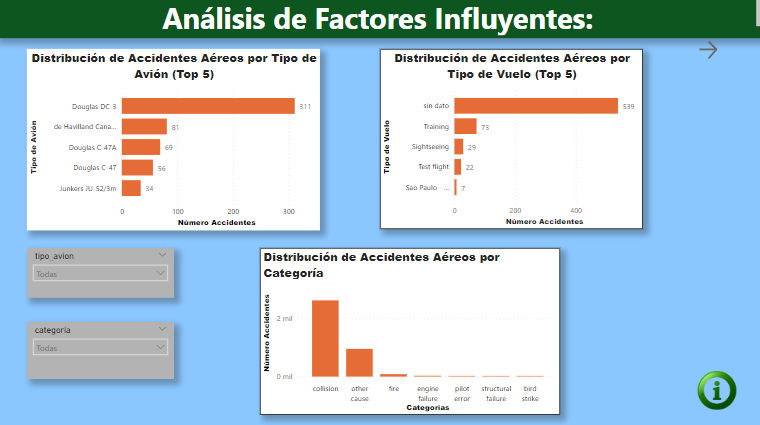

  

  <h1>Accidentes Aéreos</h1>

  

# Introducción

Los accidentes aéreos son eventos trágicos que pueden tener consecuencias devastadoras. La industria de la aviación, las autoridades reguladoras y los investigadores trabajan incansablemente para mejorar la seguridad de la aviación y prevenir futuros accidentes.

La Organización de Aviación Civil Internacional (OACI), organismo de la Organización de las Naciones Unidas, quiere investigar en profundidad los accidentes producidos desde inicios del siglo XX. Para ello, ha contratado a una consultora de datos para que realice un análisis de datos relacionado a esto, junto a un dashboard que complemente los análisis con sus visualizaciones.

El objetivo de este proyecto es obtener una comprensión más profunda de las causas de los accidentes aéreos. Esto ayudará a la OACI a identificar áreas donde se pueden implementar mejoras para mejorar la seguridad.

# Objetivos

El proyecto tiene los siguientes objetivos:

- Realizar un análisis de datos de los accidentes aéreos producidos desde inicios del siglo XX.

Los siguientes objetivos específicos:

- Identificar patrones históricos en la frecuencia de accidentes aéreos a lo largo de los años.
- Investigar la relación entre el tipo de vuelo.
- Identificar los tipos de aviones más comúnmente involucrados en accidentes aéreos.
- Investigar las posibles causas detrás de las categorías con alta incidencia.
- Investigar las razones detrás de la alta incidencia de accidentes en esos destinos.
- Desarrollar un dashboard que complemente los análisis con sus visualizaciones.

# Metodología

El proyecto se llevará a cabo en dos fases:

- Fase 1: Recopilación y limpieza de datos.
- Fase 2: Análisis de datos y desarrollo del dashboard.

## Fase 1: EDA (Análisis Exploratorio de los Datos)

### 1. Comprensión de datos
Los resultados de los histogramas indican que la mayoría de los accidentes tienen una cantidad similar de ocupantes, aproximadamente 33, lo que sugiere una tendencia en el tamaño de las aeronaves involucradas en los accidentes. Asimismo, se observa que la cantidad de pasajeros y miembros de la tripulación a bordo tiende a mantenerse constante, con alrededor de 33 pasajeros y 8 miembros de la tripulación. Estos hallazgos proporcionan información valiosa sobre la capacidad de las aeronaves en estos incidentes.

En lo que respecta a las pérdidas humanas, la mayoría de los accidentes resultan en alrededor de 30 fallecidos y 30 pasajeros fallecidos, lo que sugiere similitudes en la gravedad de los accidentes en términos de víctimas. No obstante, es importante destacar que el número de miembros de la tripulación fallecidos suele ser bajo, alrededor de 2, en comparación con el número de pasajeros, lo que indica una proporción diferente de víctimas entre la tripulación y los pasajeros.

Basándonos en el histograma generado, se evidencia una tendencia hacia la estabilidad en la cantidad de pasajeros y miembros de la tripulación a bordo. Por lo tanto, para abordar los valores faltantes en las columnas de "tripulación_a_bordo" y "tripulación_fallecida", optamos por sustituirlos por el valor modal correspondiente a cada columna.

Se llevó a cabo la identificación y posterior eliminación de valores atípicos en las columnas numéricas, incluyendo 'total_ocupantes', 'pasajeros_a_bordo', 'tripulacion_a_bordo', 'fallecidos', 'pasajeros_fallecidos' y 'tripulacion_fallecida'. Estos valores atípicos representaban aproximadamente el 10% de los datos en el conjunto de datos y se tomaron medidas basadas en consideraciones comerciales y para preservar la integridad de las estadísticas.

Después de esta limpieza de datos, se procedió a desarrollar un modelo predictivo para imputar los valores faltantes en las columnas 'hora' (con un 31% de datos faltantes) y 'fallecidos_en_tierra' (con un 0.6% de datos faltantes). Esto permitió completar la información de estas columnas de manera precisa.

En el caso de la columna 'resumen', se llevó a cabo un proceso de búsqueda de palabras clave con el propósito de categorizarla de forma descriptiva. Esto mejoró significativamente la visualización de los datos y facilitó su análisis.

Además, se eliminaron columnas irrelevantes en el DataFrame que contenían un alto porcentaje de datos faltantes, en este caso, el 81% la columna número de vuelo.

Finalmente, se ajustaron los tipos de datos de las columnas según las necesidades del análisis. Estos pasos contribuyeron a la preparación y mejora de la calidad de los datos en el conjunto de datos.

## Fase 2: Análisis profundo de los datos

### 1. Análisis de tendencias a lo largo del tiempo:

  

El gráfico muestra la 'Tendencia de Accidentes Aéreos por Año'. Aquí se puede observar un patrón interesante en la frecuencia de accidentes aéreos a lo largo del tiempo.

Hasta el año 1935, la cantidad de accidentes se mantuvo en niveles relativamente bajos y estables. Sin embargo, a partir de ese año, se evidencia un incremento significativo en la frecuencia de accidentes, alcanzando un pico de 75 accidentes en el año 1950.

A partir de ese punto, la cantidad de accidentes se mantuvo casi constante durante varias décadas, hasta llegar al año 2010. En ese momento, comenzó a notarse un descenso notable en la cantidad de accidentes, y esta tendencia a la baja continuó de manera marcada. En el año 2010, la cantidad de accidentes aéreos se redujo a un mínimo de 15.

Este análisis de tendencia revela una notable fluctuación en la seguridad de la aviación a lo largo de los años, con un período de aumento de accidentes seguido por una marcada mejora en la seguridad aérea a partir del año 2010.

### 2. Análisis de factores influyentes:

  

**Tipo de vuelo**

La categoría "Sin Dato" es la más destacada en términos de accidentes aéreos, lo que sugiere que la falta de información puede ser un factor importante en los accidentes. Esto podría deberse a una variedad de factores, como la falta de informes completos de accidentes, la falta de seguimiento de los accidentes o la falta de información sobre las causas de los accidentes.

Las categorías "Training" y "Test Flight" también presentan un número significativo de accidentes, lo que sugiere que las actividades de capacitación y pruebas pueden ser propensas a accidentes. Esto podría deberse a que los pilotos y las aeronaves están bajo mayor estrés durante estas actividades, lo que aumenta el riesgo de errores.

**Tipo de avión**

El avión "Douglas DC-3" es el tipo de avión más comúnmente involucrado en accidentes aéreos, lo que podría indicar que este modelo específico puede tener desafíos de seguridad. Sin embargo, es importante tener en cuenta que el DC-3 es un avión antiguo que ha estado en servicio durante muchos años. Es posible que su mayor participación en accidentes se deba a su antigüedad y al hecho de que ha sido operado por una variedad de operadores en una variedad de condiciones.

Los aviones "De Havilland Canada DHC-6 Twin Otter 300" y "Douglas C-47A" también muestran una incidencia considerable en accidentes. Estos aviones son modelos pequeños y ligeros que pueden ser más propensos a accidentes en condiciones climáticas adversas o en entornos montañosos.

**Categoría**

La categoría "Collision" lidera en términos de accidentes, lo que sugiere que las colisiones son un factor importante en los accidentes aéreos. Esto podría deberse a una variedad de factores, como el tráfico aéreo congestionado, los errores de los pilotos y las condiciones climáticas adversas.

La categoría "Other Cause" también presenta un número significativo de accidentes, lo que indica que existen diversas causas detrás de los accidentes aéreos, distintas de las colisiones. Estas causas pueden incluir fallos mecánicos, errores humanos, condiciones climáticas adversas y actos de interferencia ilícita.

**Conclusiones**

**En general, los datos sugieren que la falta de información, las actividades de capacitación y pruebas, así como las colisiones, son factores influyentes clave en los accidentes aéreos. Estos hallazgos podrían ser útiles para enfocar futuros esfuerzos de seguridad y prevención de accidentes en la industria de la aviación.**

### 3. Análisis de destinos y compañías:

  

El destino con más accidentes es **Bogotá y Filipinas**, con un total de 11 accidentes.

Esto se debe a una serie de factores, como las condiciones climáticas adversas, la topografía accidentada y la falta de infraestructura aeroportuaria.

- Las **condiciones climáticas adversas**, como las tormentas tropicales y los tifones. Estos fenómenos meteorológicos pueden dificultar el control de los aviones y aumentar el riesgo de accidentes.

- La **topografía accidentada** de Filipinas también puede contribuir al riesgo de accidentes. El país tiene muchas montañas, valles y ríos, lo que puede hacer que sea difícil aterrizar o despegar de manera segura.

- La **falta de infraestructura aeroportuaria** en Filipinas también puede contribuir al riesgo de accidentes. Muchos aeropuertos del país son pequeños y carecen de las últimas tecnologías de seguridad.

### Compañía con más Accidentes

La compañía con más accidentes es **Aeroflot**, con 160 accidentes.

Esto se debe a una serie de factores, como la antigüedad de la flota, la falta de inversión en seguridad y la corrupción.

- La **flota de Aeroflot** es una de las más antiguas del mundo. Muchos de los aviones de la compañía tienen más de 20 años. Los aviones más antiguos son más propensos a sufrir fallas mecánicas, lo que puede aumentar el riesgo de accidentes.

- Aeroflot ha sido criticada por su **falta de inversión en seguridad**. La compañía ha sido acusada de ahorrar dinero en mantenimiento y capacitación de pilotos. Estas medidas de ahorro pueden aumentar el riesgo de accidentes.

- La **corrupción** también ha sido un problema para Aeroflot. La compañía ha sido acusada de pagar sobornos para evitar inspecciones de seguridad. Esto puede permitir que aviones con fallas mecánicas operen, lo que aumenta el riesgo de accidentes.

### 4. Análisis de fatalidad de la Tripulación (KPI)

### Objetivo:
- Evaluar la disminución de un 10% en la tasa de fatalidad de la tripulación en los últimos 10 años, comparado con la década anterior.

### Nombre del KPI:
- Tasa de Fatalidad de la Tripulación (Comparación Decadal)

### Forma de Medida:
La tasa de fatalidad de la tripulación se mide calculando el número total de tripulantes fallecidos en accidentes registrados durante un período de 10 años y dividiéndolo por la cantidad total de accidentes aéreos ocurridos en ese mismo período de tiempo. La fórmula para calcular esta tasa es:

### Meta:
La meta es lograr una disminución del 10% en la tasa de fatalidad de la tripulación en los últimos 10 años en comparación con la década anterior. Esto significa que la tasa de fatalidad de la tripulación en los últimos 10 años debe ser un 10% menor que la tasa de fatalidad de la tripulación de la década anterior. La meta se expresa como una reducción del 10% en la tasa en términos porcentuales.

  

### Análisis de la Tasa de Fatalidad de la Tripulación:

El análisis de las tasas de fatalidad de la tripulación en las dos últimas décadas indica que la seguridad de la tripulación en accidentes aéreos no ha mejorado en la década actual en comparación con la década anterior.

- En la década actual, la tasa de fatalidad de la tripulación fue del 88.63%, lo que indica que un alto porcentaje de accidentes aéreos en esta década resultaron en fatalidades entre la tripulación. En la década anterior, la tasa de fatalidad de la tripulación fue del 82.89%, lo que muestra que hubo una tasa ligeramente menor de fatalidades entre la tripulación en la década anterior.

- La reducción porcentual en la tasa de fatalidad de la tripulación entre la década anterior y la década actual es del -6.92%, lo que indica que, en lugar de haber una mejora en la seguridad de la tripulación, ha habido un aumento en la tasa de fatalidad en la década actual en comparación con la década anterior.

Este aumento es significativo, ya que sugiere que los esfuerzos de seguridad no han tenido éxito en reducir las fatalidades en la tripulación de manera significativa. Esto subraya la necesidad de investigar y abordar las causas de los accidentes aéreos y tomar medidas efectivas para mejorar la seguridad de la tripulación en la industria de la aviación.

Algunas posibles causas del aumento en la tasa de fatalidad de la tripulación en la década actual incluyen:

- El aumento de la complejidad de los aviones, que dificulta la recuperación de accidentes.
- El cambio climático, que puede provocar condiciones meteorológicas adversas que pueden provocar accidentes.

### 5. Eficiencia de la Seguridad Aérea (KPI)

### Objetivo:
- Evaluar la disminución de un 5% en la tasa de supervivencia de pasajeros en accidentes aéreos en los últimos 5 años, comparado con los 5 años anteriores.

### Nombre del KPI: Tasa de Supervivencia de Pasajeros

#### Forma de Medida:
- Tasa de Supervivencia de Pasajeros = (Número de pasajeros sobrevivientes) / (Número total de pasajeros a bordo)

#### Meta:
- La meta es lograr disminuir el 5% en la tasa de supervivencia en los últimos 5 años en comparación con los 5 años anteriores.

  

El objetivo de la industria de la aviación es reducir la tasa de supervivencia en un 5%. Sin embargo, los resultados muestran que la tasa de supervivencia ha disminuido en un 2.93%, lo que está por debajo del objetivo.

Ante tal desviación se pueden considerar medidas como:

- Mejorar la seguridad de los aviones. Esto podría incluir el desarrollo de nuevos materiales y estructuras que sean más resistentes a los daños.
- Mejorar la formación de los pilotos y los controladores aéreos. Esto podría incluir el entrenamiento en situaciones de emergencia.
- Mejorar la concienciación sobre la seguridad entre los pasajeros. Esto podría incluir la capacitación en seguridad para los pasajeros.

Tomando estas medidas, se puede reducir la tasa de fatalidad en accidentes aéreos y mejorar la seguridad en la industria de la aviación.

# Diccionario de Datos

Las bases de datos generadas incluyen las siguientes columnas con información sobre accidentes aéreos:

1. Fecha: La fecha en que ocurrió el accidente aéreo.
2. Hora: La hora en que tuvo lugar el accidente aéreo.
3. Destino: El lugar de llegada del vuelo aéreo.
4. Compañía: La compañía aérea involucrada en el accidente.
5. Tipo de vuelo: El tipo de vuelo (por ejemplo, comercial, privado, etc.).
6. Tipo de avión: El tipo de aeronave involucrada en el accidente.
7. Registro: El número de registro del accidente.
8. ID de aeronave: Una identificación única de la aeronave.
9. Total de ocupantes: La cantidad total de personas a bordo del avión.
10. Pasajeros a bordo: La cantidad de personas a bordo en calidad de pasajeros.
11. Tripulación a bordo: La cantidad de personas a bordo en calidad de tripulación.
12. Fallecidos: La cantidad de personas fallecidas como resultado del accidente.
13. Pasajeros fallecidos: La cantidad de personas fallecidas entre los pasajeros.
14. Tripulación fallecida: La cantidad de personas fallecidas entre la tripulación.
15. Fallecidos en tierra: Número de fallecidos en el suelo como consecuencia del accidente.
16. Resumen: Un resumen del accidente aéreo.
17. País: El país de destino del vuelo.
18. Año: El año en que ocurrió el accidente.
19. Mes: El mes en que ocurrió el accidente.
20. Categoría: El tipo de accidente.
21. Sobrevivientes: La cantidad de personas que sobrevivieron al accidente.

# Requerimientos

Asegúrate de tener instalado lo siguiente:

- Python
- Scikit-Learn
- Pandas
- re
- Matplotlib
- Seaborn
- Numpy
- Scipy
- ntlk

# Conclusiones

1. **Necesidad de Mejorar la Recopilación y Análisis de Datos**: La falta de datos detallados y análisis precisos sobre accidentes aéreos es un obstáculo importante para la mejora de la seguridad en la aviación. Identificar causas específicas es crucial para desarrollar medidas preventivas efectivas.

2. **Enfoque en la Capacitación y Pruebas de Pilotos**: Los errores humanos son una causa significativa de accidentes aéreos. El desarrollo de programas de capacitación más sólidos y la implementación de pruebas más rigurosas son esenciales para reducir esta fuente de riesgo.

3. **Reducción de Colisiones Aéreas**: La gestión del tráfico aéreo y la adopción de tecnologías de seguridad son áreas críticas para abordar la reducción de colisiones aéreas. Esto no solo protege a los pasajeros, sino que también mejora la eficiencia y puntualidad de los vuelos.

4. **Mejora de la Seguridad en Destinos y Compañías de Mayor Riesgo**: Invertir en infraestructura aeroportuaria, modernizar las flotas y elevar los estándares de seguridad en las compañías aéreas con un historial problemático es fundamental para disminuir el riesgo en la aviación.

5. **Tasa Anual de Mortalidad y Supervivencia**: Las tasas de mortalidad y supervivencia actuales son preocupantes y señalan deficiencias en la seguridad aérea. Para garantizar la seguridad de los pasajeros y la tripulación, es imperativo que la tasa de mortalidad esté por debajo del rango actual y que la tasa de supervivencia esté por encima del 50%.

En resumen, abordar estos problemas es crucial para crear una industria de la aviación más segura. La seguridad aérea no solo es esencial para la protección de vidas humanas, sino que también tiene un impacto en la confianza del público y en la eficiencia de la industria. La mejora en la recopilación de datos, la capacitación de personal, la gestión del tráfico aéreo y la inversión en seguridad en destinos y compañías son pasos críticos hacia un futuro más seguro en la aviación.

Elaborado por: **Marianela Garcia**
Correo Electrónico: [garciagnela@gmail.com](mailto:garciagnela@gmail.com)